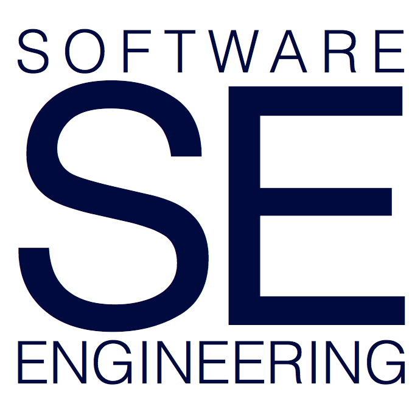

# UBC CPSC 410 - Advanced Software Engineering
January 2017 -> April 2017 (```2016T2```)


## Overview

Specification, Design, Construction and Validation of Multi-Version
Software Systems.

When you have completed this course, you should be able to:

* Understand the benefits and disadvantages of various architectures for constructing large, multi-version, multi-component software systems.
* Apply software verification and validation techniques to the analysis of such projects.
* Demonstrate ability in building a large, complex software project using modern software engineering technologies.
* Communicate your architectural rationale, and provide insight into requirements traceability to code.

## Contact

#### Instructor: To start, [Gail Murphy](https://blogs.ubc.ca/gailcmurphy/)
#### Office hours: January 11 11am-12pm ICICS 305, or email murphy at cs.ubc.ca for an appointment

#### TAs:

* Daniel Almeida
* Arthur Marques

## Schedule

#### Lecture: 

Thursdays 1700-2000, Assume DMP 301 for now but check back for changes

This list is a rough guide only. Readings will likely be updated even after class has completed.

| Date        | Topics (may span multiple lectures)         |
| :--         |:--                                          | 
| Jan 5       | Introduction & Specifications |
| Jan 12      | Specifications cont. |
| Jan 19      | Modularity & Decomposition |
| Jan 26      | TBD |
| Feb 2       | TBD |
| Feb 9       | TBD |
| Feb 16      | TBD |
| Feb 23      | TBD |
| Mar 2       | TBD |
| Mar 9       | TBD |
| Mar 16      | TBD |
| Mar 23      | TBD |
| Mar 30      | TBD | 
| Apr 6       | TBD | 

[Piazza](https://piazza.com/) has not yet been configured for this term. Please be mindful of the UBC Academic Misconduct Policy with respect to posting project solutions and when interacting with your peers and course staff. We will do our best to be involved in Piazza discussions but will be most responsive during the week.


#### TA Office Hours

TBD

## Project

The project forms an integral part of this course. The goal of the project is to produce a significant mobile app that performs some useful function. This software must have a considered and defensible architecture. There are only a few restrictions on the app idea itself, in particular, the app 

* has to be a mobile app and you have to demo your app on a mobile device (iOS, Android, BB10, WP8, or FirefoxOS) 
* has to interact with a server with a REST API that you created
* cannot just be a database management app (e.g., simple CRUD apps that do not make sense in a mobile context)
* cannot be an app that requires crowd buy-in (e.g., apps that would require large numbers of people to contribute content to be viably useful)
 
You can use any libraries you wish.
 
After the prototype demo, we will provide a 'pivot' to each group; this will consist of a new or modified requirement for your app that you will have to include for the final demo (and write about in the architecture and design deliverable).

The projects will be completed in teams of four. You are free to select your own team; if you do not have a team or your team has less than four members, please talk to the instructor.

Projects will have a difficulty scale applied to them by the instructor and TAs. The scale formula will be: 

(project + bonus) * scale + individual = final project grade

Scale will range between 0.75 and 1.0. The components of the scaling mark will be determined by:

* 5: completeness (compared to proposal)
* 5: utility
* 5: polish
* 10: difficulty

The individual part makes up 4% of the project and corresponds to the individual user reviews for the other apps. There will also be various sources of bonus marks during the term; each will be worth 2%:

* Best pitch
* Best prototype demo
* Best final demo
* Accepted to curated App Store (iOS, Blackberry, Windows Phone)
 
NOTE: The expectation is that you will work approximately 12 hours per week on this course; at least 5 of these hours should be on the project. Given that the course lasts 13 weeks, each team member is expected to work on the project at least 65 hours. You should be able to accomplish something pretty great in this time; please make the most of this opportunity. While lines of code is a terrible metric, no past project has been less than 5 KLOC and most range between 10-20 KLOC.


## Project Schedule

*Overview*

This table provides an overview of the due dates. See below for
details on what time of day and in what format each deliverable must
be provided.

| Date  | Deliverable | Project Grade % |
| :--         | :-- | :--        
| Jan 5, end of class | Background | Pass/Fail |
| Jan 12, 11:59pm | Group Formation | Pass/Fail |

*Details: TBD*

## Grading


To pass the course and receive credit you must achieve a passing grade on *both* the project and the final exam. Sample midterm and final exams will not be available.


## Policies

<a name="waitlist"></a>
### Waitlist

There is extremely high demand for this course this term. If you are on the waitlist and wish to join the class, please come to the front after **EVERY** class to sign in. Those students who have signed into every class by the add/drop date will be forwarded to the advisors who will insert students into available spots by the add/drop deadline. This does not guarantee you will be admitted, but without signing in every class you will not be eligible. Students on the waitlist should not form groups with students who are already enrolled in case your whole group does not make it into the course this term. Unfortunately, the instructor is not able to override class seat assignments or the waitlist itself.

If you are on the waitlist you should still attend and sign into a lab section so you understand what is happening in the course, and so you do not miss out on the lab attendance marks.

### Late Submissions

All project deliverables must be submitted on time. Late submissions cannot be accepted.

### Accommodation

If you are sick and unable to write the midterm, please contact the instructor as soon as possible -- provide medical documentation.
Students who miss the final exam due to illness should consult the Faculty of Science Policy on missed exams. Note that students who do  not have sufficient standing during the term may not qualify for academic concession if they miss the final.
Students who require dispensation based on their unique circumstances should refer to the UBC policy on Academic Concessions.
Cell phones, calculators, translators, and all other electronic devices are prohibited on desks during exams. They must be turned off and placed in your bag or on the ground. Students who need exam accommodation must make an official request to the Access and Diversity Office.

### Academic Conduct

Each student is responsible for understanding and abiding by the University and Departmental policies on academic conduct. Specifically:

* [UBC policy on Academic Misconduct](http://www.calendar.ubc.ca/vancouver/index.cfm?tree=3,54,111,959)
* [Computer Science Department Lab policies and responsibilities](https://www.cs.ubc.ca/our-department/administration/policies/collaboration)

### Respectful Environment

Everyone involved with CPSC 410 is responsible for understanding and abiding by the University's Respectful Environment Statement.

The Statement of Principle of UBC's Respectful Environment Statement is "The best possible environment for working, learning and living is one in which respect, civility, diversity, opportunity and inclusion are valued. Everyone at the University of British Columbia is expected to conduct themselves in a manner that upholds these principles in all communications and interactions with fellow UBC community members and the public in all University-related settings."
